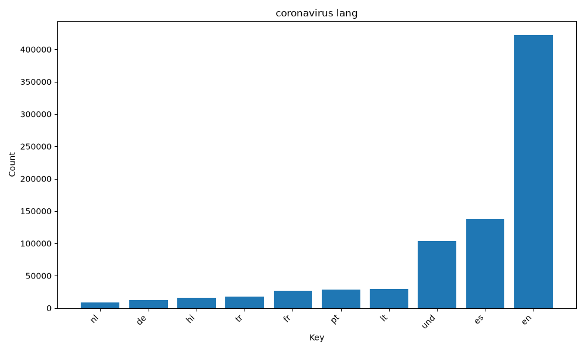
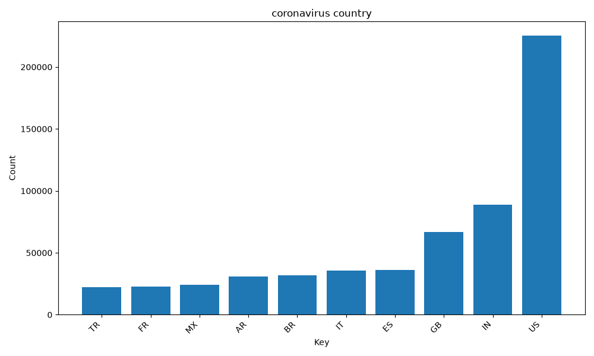
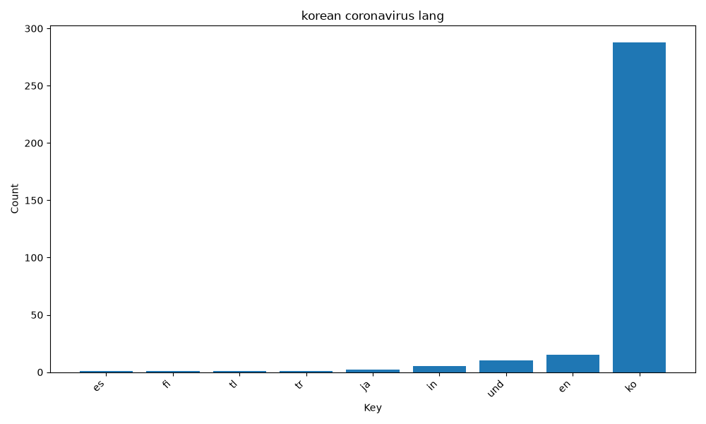
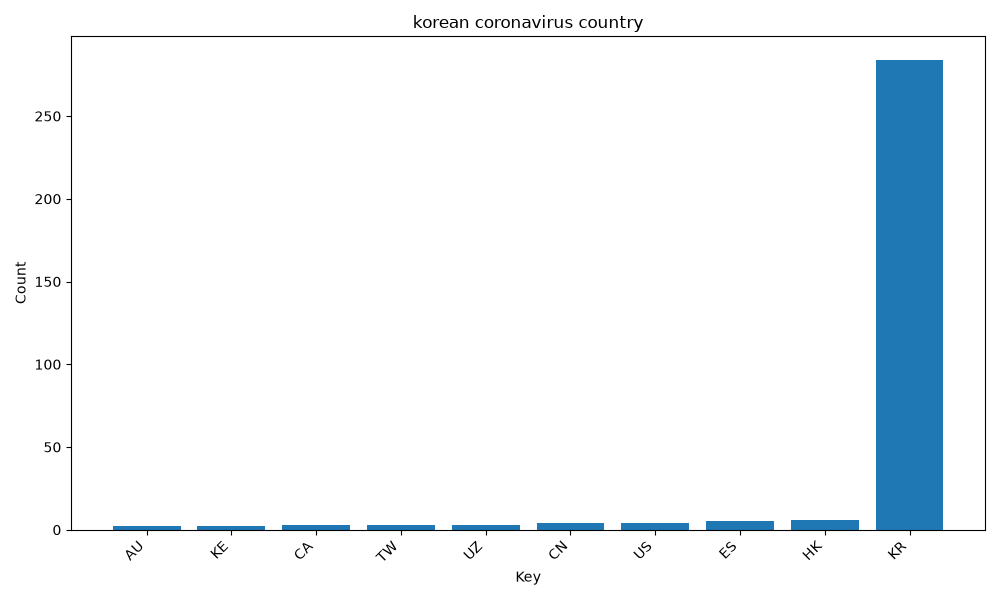
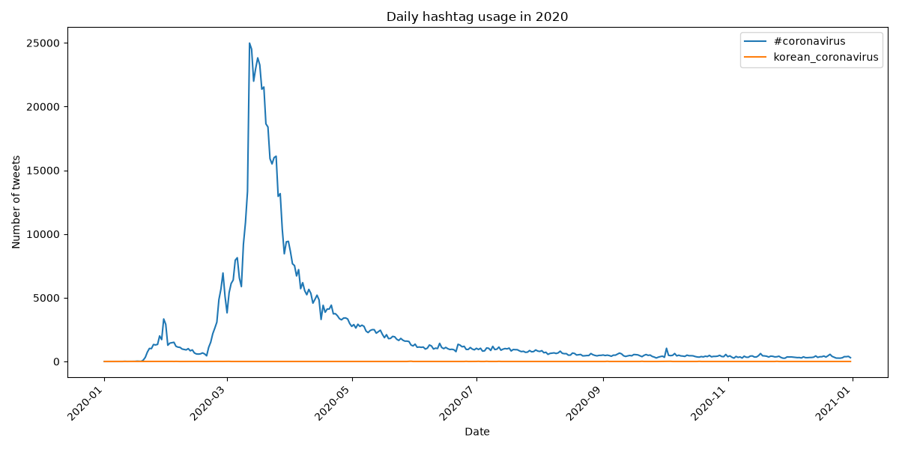

# Coronavirus Twitter Analysis

This project analyzes geotagged tweets from 2020 to study how coronavirus-related hashtags appeared across languages and countries. The dataset contains daily zip files of geotagged tweets, and I used a MapReduce workflow to process the data efficiently.

## Methods

The mapper scans each tweet and counts selected coronavirus-related hashtags by language and country. The reducer combines the daily mapper outputs into yearly totals. I then used Python and matplotlib to create visualizations of the most common languages and countries for selected hashtags.

## Results

### #coronavirus by Language

### #coronavirus by Country

### Korean Coronavirus Hashtag by Language

### Korean Coronavirus Hashtag by Country

## Daily Hashtag Trends

The alternative reducer creates a time-series plot showing daily usage of selected hashtags throughout 2020.

## Tools Used

- Python
- JSON
- zipfile
- MapReduce
- nohup and shell scripting
- matplotlib
