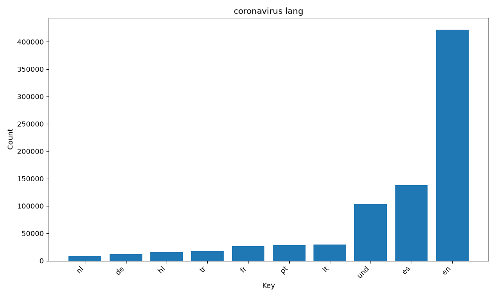
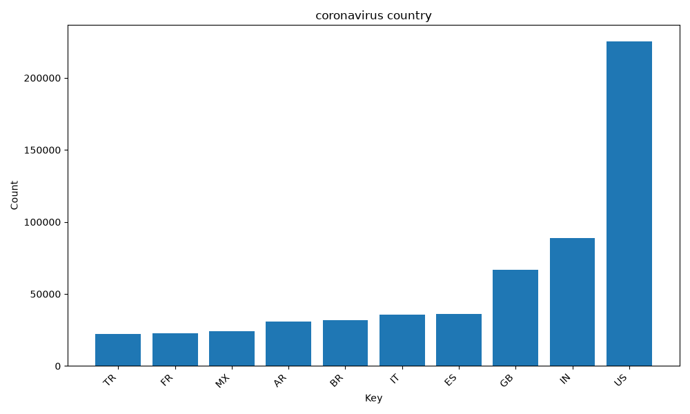
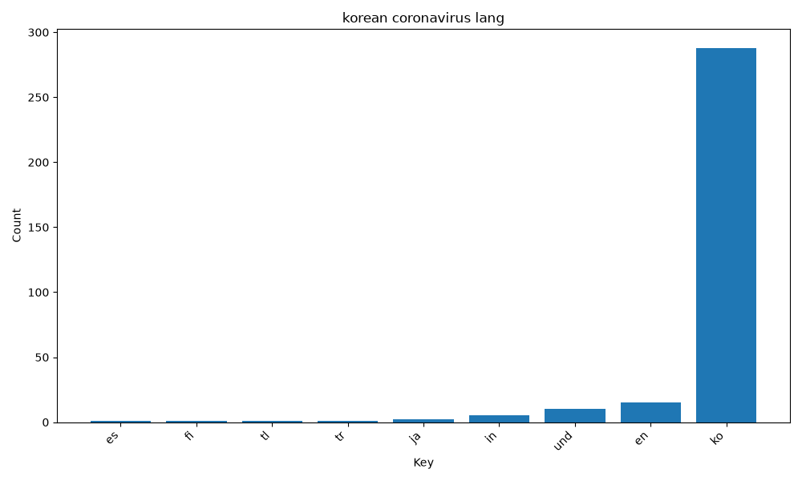
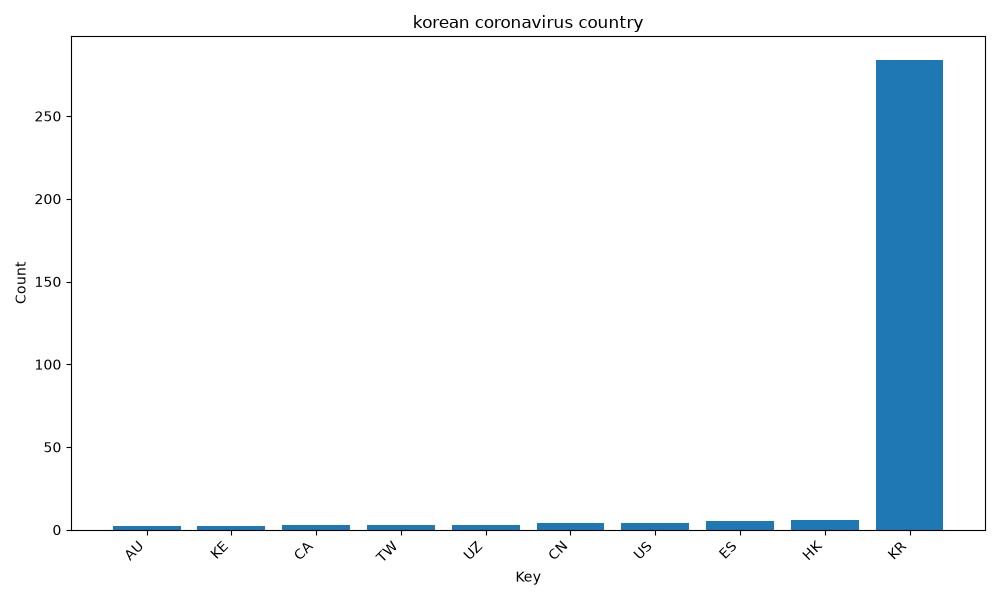
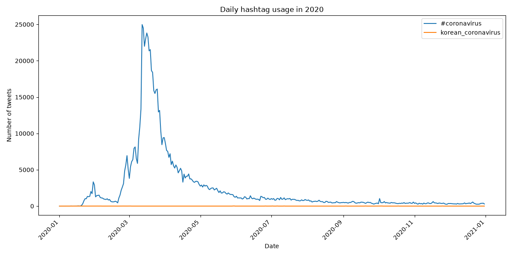

# Coronavirus Twitter Analysis

In this project, I analyzed geotagged tweets from 2020 to see how coronavirus-related hashtags were used across different languages and countries. Because the dataset contains more than a billion tweets, I used MapReduce to process the data in parallel.

## Methods

I created a mapper that goes through the tweets and counts selected coronavirus-related hashtags by language and country. I then used a reducer to combine the daily results into totals for the year. Finally, I used Python and matplotlib to visualize the results.

## Results

### #coronavirus by Language

English was by far the most common language for tweets using #coronavirus, followed by Spanish and tweets without a defined language.

### #coronavirus by Country

The United States had the highest number of tweets using #coronavirus, followed by India and the United Kingdom.

### Korean Coronavirus Hashtag by Language

Korean was by far the most common language for tweets using #코로나바이러스, while the hashtag appeared only a few times in other languages.

### Korean Coronavirus Hashtag by Country

South Korea clearly had the highest use of #코로나바이러스. The hashtag appeared only a few times in other countries, including Hong Kong, Spain, and the United States.

## Daily Hashtag Trends

I also created an alternative reducer to see how hashtag use changed throughout 2020. The graph compares the daily use of #coronavirus and #코로나바이러스. The Korean hashtag looks almost flat because its daily counts are much smaller than those of #coronavirus.

## Tools Used

- Python
- JSON
- zipfile
- MapReduce
- nohup and shell scripting
- matplotlib
